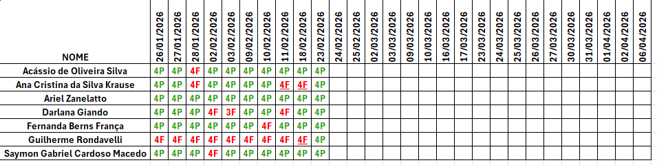

# 🌐 Curso Técnico em Desenvolvimento de Sistemas  
## Unidade Curricular: Banco de Dados  

Bem-vindo ao repositório da disciplina de **Banco de Dados** do curso **Técnico em Desenvolvimento de Sistemas** oferecido pelo **SENAI Paraná**.  
Aqui você encontrará materiais de apoio, slides, scripts SQL, exemplos práticos, atividades e avaliações referentes à UC de Banco de Dados.  

---

## 📌 Informações Gerais

- **Curso:** Técnico em Desenvolvimento de Sistemas  
- **Módulo:** Específico I  
- **Unidade Curricular:** Banco de Dados  
- **Carga Horária:** 120h  
- **Modalidade:** Presencial com até 14% EaD  

---

## 🎯 Objetivo da UC

Propiciar o desenvolvimento de **capacidades técnicas e socioemocionais** requeridas para a modelagem e manipulação de dados por meio de Sistemas de Gerenciamento de Banco de Dados (SGBD), de acordo com padrões de qualidade, robustez, integridade e segurança.  

---

## 📚 Conteúdos Formativos

- **Big Data**
  - Extração de dados estruturados  
  - Fundamentos de PL/SQL  
  - Banco de dados não relacional  

- **Metodologia de Segurança de Dados**
  - Métodos  
  - Rastreabilidade  
  - Ferramentas da qualidade  

- **Gerenciamento do Banco de Dados**
  - Sistemas de Gerenciamento de Banco de Dados  
    - Definições  
    - Tipos  
    - Características  
    - Aplicações  
    - Instalação, configuração e requisitos mínimos  
    - Segurança  
    - Backup  
  - Manipulação de banco de dados  
  - Ferramentas  
  - DDL, DML e DCL  
  - Triggers  
  - Stored Procedures  
  - Views  

- **Modelagem de Dados**
  - Definição  
  - Modelo conceitual (Entidade/Relacionamento)  
  - Modelo lógico e físico  
  - Restrições  
  - Dependência funcional  
  - Normalização  

- **Banco de Dados**
  - Definição  
  - Sistema de banco de dados  
  - Características  
  - Armazenamento  
  - Arquitetura  
    - Relacional  
    - Não-relacional  

- **Diretrizes Empresariais**
  - Missão  
  - Visão  
  - Política da Qualidade  

- **Ética**
  - Ética nos relacionamentos profissionais  
  - Respeito às individualidades  
  - Ética no desenvolvimento das atividades profissionais  

- **Organização de Dados**
  - Estruturação e organização de dados  
  - Coleta de dados  
  - Formas de apresentação  
  - Sistematização e tratamento de dados  

---

## 🤝 Capacidades Desenvolvidas

### Técnicas
- Identificar conceitos, tipos, características e armazenamento de banco de dados  
- Distinguir arquitetura de banco de dados de acordo com a aplicação  
- Aplicar técnicas de modelagem de dados  
- Aplicar normalização e padronização de dados  
- Instalar e configurar SGBD conforme especificações  
- Manipular banco de dados utilizando DDL, DML e DCL  
- Criar e utilizar Triggers, Stored Procedures e Views  
- Aplicar procedimentos de segurança e backup  
- Utilizar ferramentas de manipulação de banco de dados  
- Documentar código SQL  

### Socioemocionais
- Apresentar comportamento ético  
- Tomar decisões no planejamento e resolução de problemas  
- Demonstrar profissionalismo  
- Sintonia com as diretrizes institucionais  

---

## 🖥️ Ambientes e Recursos Utilizados

- AVA com recursos de interatividade  
- Laboratório de informática  

**Ferramentas e Equipamentos**
- Ferramentas para manipulação de banco de dados  
- Sistemas de Gerenciamento de Banco de Dados  
- Computadores com requisitos mínimos  
- Sistemas operacionais  
- Projetor multimídia  

**Recursos Didáticos**
- Manuais, normas e especificações técnicas  
- Internet  
- Livros, apostilas e revistas  

---

## 📖 Livro de Referência – Curso de Bando de Dados (SENAI)

Este é o link oficial do **livro digital que será utilizado como material de apoio no curso de Banco de Dados do SENAI**:

👉 [Acessar o livro](https://estantedelivros.senai.br/view/1_624vYD3EctYvJCfoNRDl30hqPszUP_7)

Todos os dias, durante as aulas, vocês deverão acessar este link para acompanhar o conteúdo, realizar as leituras orientadas e consultar sempre que necessário.  
O material será a base para as explicações, atividades práticas e discussões em sala.

---

## 📂 Estrutura do Repositório

```
/BancoDeDados
│
├── Aulas
│   └── slides
│
├── Exemplos
│   └── Material de Apoio
│
├── Exercícios
│   ├── listas
│   ├── trabalhos
│   └── projetos
│
└── Provas
    ├── provas
    └── recuperacao
```

---

## 📊 Critérios de Frequência e Aproveitamento

No curso, o(a) aluno(a) deve atender aos seguintes requisitos para ser considerado(a) **aprovado(a)**:  

- **Frequência mínima:** 75% de presença em cada unidade curricular.  
- **Nota mínima:** média final igual ou superior a **7,0 (sete)**.  

### Como são contabilizadas as faltas:
- Cada **dia letivo corresponde a 4 aulas (4 horas-aula)**.  
- As faltas são computadas **por aula** (não por dia).  
- Se o(a) aluno(a) faltar um dia inteiro → equivale a **4 faltas**.  
- Em **IoT (120h = 30 dias = 120 aulas)** → o limite de 25% equivale a **30 faltas permitidas (7 dias e meio)**.  

### Exemplo de cálculo:
Um(a) aluno(a) com 8 dias de ausência completos em IoT:  
- 8 dias × 4 aulas = **32 faltas**  
- 120 aulas no total → 25% = **30 faltas permitidas**  
- Resultado: **Reprovado(a) por frequência**, mesmo que tenha média ≥ 7,0.  

---

## 📝 Critérios de Avaliação

- A avaliação é **contínua e cumulativa** (diagnóstica, formativa e somativa).  
- São considerados aspectos **qualitativos e quantitativos**:  
  - Participação e assiduidade  
  - Realização de atividades práticas e teóricas  
  - Trabalhos individuais e em grupo  
  - Relatórios, projetos e provas  
  - Desenvolvimento de soluções IoT aplicadas  

### Sistema de Notas
- As notas são expressas de **0,0 a 10,0**.  
- A média mínima exigida para aprovação é **7,0 (sete)**.  
- Caso o(a) aluno(a) não alcance 7,0, poderá realizar **Recuperação Final**.  

### Fórmula da Recuperação Final

A nota final (NF) é calculada pela média aritmética entre a nota do período (N) e a nota da recuperação final (RF):

**Onde:**
- `N` = nota obtida no período (0.0 a 10.0)  
- `RF` = nota obtida na recuperação final (0.0 a 10.0)  
- `NF` = nota final após a recuperação

**Exemplos:**
- Exemplo 1:
  - N = 6.0
  - RF = 4.0
  - NF = (6.0 + 4.0) / 2 = **5.0**

- Exemplo 2:
  - N = 8.0
  - RF = 7.0
  - NF = (8.0 + 7.0) / 2 = **7.5**

**Observações importantes:**
- A média mínima para aprovação **sem recuperação** é **7,0**.
- Depois da recuperação, considera-se aprovado quem obtiver **NF ≥ 5,0** (conforme política de recuperação do curso).
- Mesmo com NF suficiente, o(a) aluno(a) deve cumprir a **frequência mínima de 75%** para ser considerado(a) aprovado(a).


⚠️ Importante:  
- Mesmo que a nota seja suficiente, **frequência abaixo de 75% reprova automaticamente**.  

---


## 📅 Calendário da Disciplina

Confira o calendário de aulas, atividades e avaliações da disciplina de Banco de Dados no arquivo anexo:  
👉 [Calendário Banco de Dados](https://github.com/KevinSGuimaraes/TecnicoEmDesenvolvimentoDeSistemas/blob/main/Banco%20de%20Dados/Imagens/Calend%C3%A1rio.pdf)

---

## Lista de Presença


---

## 📝 Notas da Disciplina

Data da Avaliação   - 30/03/2026
Data da Recuperação - 06/04/2026

Acompanhe as notas e o desempenho da turma no arquivo anexo:  

$$
MF = \frac{DER + MER + MF + Beecrownd + Prova}{5}
$$

👉 [Notas Banco de Dados](Imagens/Notas.png)

---

## 📝 Plano de Curso

Acompanhe as notas e o desempenho da turma no arquivo anexo:  
👉 [Plano de Curso](https://github.com/KevinSGuimaraes/TecnicoEmDesenvolvimentoDeSistemas/blob/main/Banco%20de%20Dados/Imagens/Plano%20de%20Curso%20-%20UC%20Banco%20de%20Dados.pdf)

---
## 📬 Contato

- **Instrutor:** Kevin de Souza Guimarães  
- **Email:** kevin.guimaraes3561@sesisenaipr.org.br  
