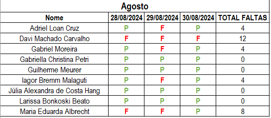
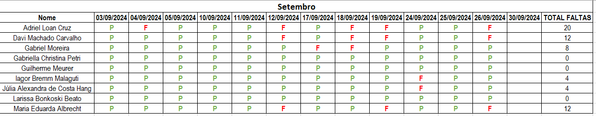

# 
 Curso Técnico em Desenvolvimento de Sistemas 

# 
 SENAI DOIS VIZINHOS - PR 

Bem-vindo ao repositório da disciplina **Desenvolvimento de Sistemas** do curso Técnico em Desenvolvimento de Sistemas do SENAI Dois Vizinhos - PR. Aqui você encontrará todos os materiais, exercícios e atividades relacionadas às aulas ministradas.

## Índice

- [Visão Geral](#visão-geral)
- [Estrutura do Repositório](#estrutura-do-repositório)
- [Tecnologias Utilizadas](#tecnologias-utilizadas)
- [Contato](#contato)

## Visão Geral

Esta disciplina tem como objetivo proporcionar o desenvolvimento das capacidades técnicas e socioemocionais necessárias para o desenvolvimento de sistemas computacionais, atendendo normas e padrões de qualidade, usabilidade, robustez, integridade e segurança da informação.

### Carga Horária
- **Total**: 200 horas

### Objetivo Geral
Propiciar aos alunos a capacidade de desenvolver sistemas utilizando linguagens de programação, frameworks, bibliotecas, conforme padrões de desenvolvimento e requisitos de qualidade, usabilidade e segurança.

### Conteúdos Formativos

#### 1. Codificação de Sistemas
- Análise de requisitos conforme regras de negócio.
- Arquitetura de sistemas, garantindo qualidade, integridade e segurança da informação.
- Linguagens de programação para integração de sistemas multiplataforma.
- Aplicação de boas práticas e padrões de desenvolvimento (versionamento, documentação, depuração).

#### 2. Ferramentas e Metodologias
- Plataformas de desenvolvimento em nuvem.
- Ferramentas de controle de versão (Git, GitHub).
- Gerenciamento de configuração e rastreabilidade.
- Ferramentas para gestão de prazos e atividades.
- Metodologias de desenvolvimento ágeis.

#### 3. Linguagens de Programação
- HTML5, CSS3 e JavaScript para desenvolvimento front-end e interatividade.
- PHP8 para programação back-end, Será realizada integração/conexão com o banco de dados (PostgreSQL).
- Desenvolvimento de sistemas estruturados, com ênfase na integração entre front-end e back-end.

### Plano de Aula

### Calendário Disciplina

### Capacidades Desenvolvidas
- Desenvolver sistemas de acordo com padrões de usabilidade, robustez e segurança.
- Integrar diferentes sistemas utilizando bibliotecas e conexão com banco de dados.
- Aplicar metodologias ágeis no desenvolvimento dos projetos.
- Utilizar ferramentas de controle de versão para gerência de configuração e colaboração.

### Ambientes Pedagógicos
- Laboratório de informática equipado com sistemas operacionais, IDEs e ferramentas de desenvolvimento.

### Competências Socioemocionais
- Colaboração em atividades coletivas e projetos.
- Organização e planejamento no desenvolvimento de atividades técnicas.
- Comunicação eficaz e comportamento profissional em equipes de desenvolvimento.

## Estrutura do Repositório

- `aulas/`: Contém os materiais das aulas, como slides, notas e códigos de exemplo.
- `exercicios/`: Contém os exercícios propostos durante o curso.
- `referencias/`: Contém materiais de referência adicionais.

## Tecnologias Utilizadas

- **Front-end**: HTML5, CSS3, JavaScript
- **Back-end**: PHP8
- **Banco de Dados**: PostgreSQL
- **Controle de Versão**: Git, GitHub

### Estruturação do Projeto

O projeto final da disciplina será a unificação de todos os conceitos trabalhados em sala de aula. Desenvolveremos um sistema completo utilizando **PHP** para o back-end, com conexão ao banco de dados **PostgreSQL**, e **JavaScript** será utilizado para interações nas páginas web. Todo o código será bem estruturado, seguindo boas práticas de desenvolvimento. 

## Faltas

## Notas

## Contato

Para dúvidas ou mais informações, entre em contato:

Instrutor: **[Kevin de Souza Guimarães]**  
Email: **[kevinguimaraes.trabalho@gmail.com]**

Aproveite o curso e bons estudos!

