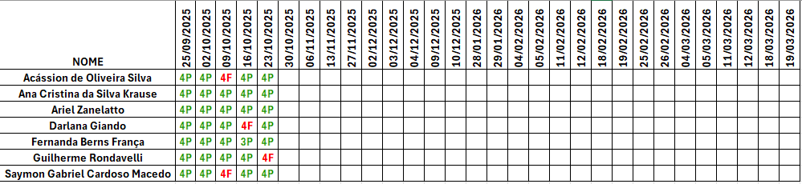

# 🌐 Curso Técnico em Desenvolvimento de Sistemas  
## Unidade Curricular: Internet das Coisas (IoT)  

Bem-vindo ao repositório da disciplina de **Internet das Coisas (IoT)** do curso **Técnico em Desenvolvimento de Sistemas** oferecido pelo **SENAI Paraná**.  
Aqui você encontrará materiais de apoio, slides, códigos, exemplos práticos, atividades e avaliações referentes à UC de IoT.  

---

## 📌 Informações Gerais

- **Curso:** Técnico em Desenvolvimento de Sistemas  
- **Módulo:** Específico I  
- **Unidade Curricular:** Internet das Coisas  
- **Carga Horária:** 120h  
- **Modalidade:** Presencial com até 14% EaD  

---

## 🎯 Objetivo da UC

Propiciar o desenvolvimento de **capacidades técnicas e socioemocionais** relativas às atividades do técnico em desenvolvimento de sistemas impactadas pela tecnologia da **Internet das Coisas (IoT)**.  

---

## 📚 Conteúdos Formativos

- **Fundamentos de IoT:** conceitos, histórico, evolução e paradigmas  
- **Arquitetura de Sistemas IoT:** componentes, dispositivos, sensores, atuadores e protocolos de comunicação  
- **Redes de IoT:** modelos de rede, topologias, conectividade e escalabilidade  
- **Segurança em IoT:** desafios, vulnerabilidades e ameaças  
- **Desenvolvimento de Aplicações IoT:** plataformas, linguagens de programação e casos práticos  
- **Análise de Dados em IoT:** coleta de dados, processamento em tempo real e análise para tomada de decisão  
- **Casos de Uso de IoT:** aplicações em saúde, indústria, agricultura, transporte e automação residencial  
- **Tendências e Futuro da IoT:** avanços tecnológicos, oportunidades e desafios  

Além disso, são abordados:  
- **Robótica e Sensoriamento:** sensores, atuadores e parametrização de robôs  
- **Conectividade de Software:** OPC, MQTT e outros protocolos de IoT  
- **Conectividade de Hardware:** satélite, Bluetooth, Wi-Fi, rádio, RFID, Internet  
- **Linguagem de Programação:** C aplicada a microcontroladores  
- **Microcontroladores:** aplicações e Arduino  
- **Configuração de Redes de Computadores**  

---

## 🤝 Capacidades Desenvolvidas

### Técnicas
- Reconhecer especificações técnicas da IoT  
- Integrar dispositivos para coleta e transmissão de dados  
- Configurar redes e microcontroladores  
- Desenvolver soluções em C e Arduino aplicadas à IoT  

### Socioemocionais
- Organização e profissionalismo  
- Qualidade e responsabilidade  
- Trabalho em equipe e ética profissional  

---

## 🖥️ Ambientes e Recursos Utilizados

- Laboratório de Informática  
- AVA com recursos de interatividade  
- **Equipamentos:** protoboard, ferro de solda, multímetro, osciloscópio, kit Arduino avançado (Wi-Fi e Ethernet), computadores dedicados, rede de testes isolada  
- **Recursos Didáticos:** manuais técnicos, normas, livros, apostilas e revistas  

---

## 📖 Livro de Referência – Curso de IoT (SENAI)

Este é o link oficial do **livro digital que será utilizado como material de apoio no curso de Internet das Coisas (IoT) do SENAI**:

👉 [Acessar o livro](https://estantedelivros.senai.br/view/1C06_d3_6BQgqd0h9GJgFiJT065LPRn8b)

Todos os dias, durante as aulas, vocês deverão acessar este link para acompanhar o conteúdo, realizar as leituras orientadas e consultar sempre que necessário.  
O material será a base para as explicações, atividades práticas e discussões em sala.
---

## 📂 Estrutura do Repositório

```
/IoT
│
├── Aulas
│   └── slides
│
├── Exemplos
│   └── Material de Apoio
│
├── Exercícios
│   ├── listas
│   ├── trabalhos
│   └── projetos
│
└── Provas
    ├── provas
    └── recuperacao
```
---

## 📊 Critérios de Frequência e Aproveitamento

No curso, o(a) aluno(a) deve atender aos seguintes requisitos para ser considerado(a) **aprovado(a)**:  

- **Frequência mínima:** 75% de presença em cada unidade curricular.  
- **Nota mínima:** média final igual ou superior a **7,0 (sete)**.  

### Como são contabilizadas as faltas:
- Cada **dia letivo corresponde a 4 aulas (4 horas-aula)**.  
- As faltas são computadas **por aula** (não por dia).  
- Se o(a) aluno(a) faltar um dia inteiro → equivale a **4 faltas**.  
- Em **IoT (120h = 30 dias = 120 aulas)** → o limite de 25% equivale a **30 faltas permitidas (7 dias e meio)**.  

### Exemplo de cálculo:
Um(a) aluno(a) com 8 dias de ausência completos em IoT:  
- 8 dias × 4 aulas = **32 faltas**  
- 120 aulas no total → 25% = **30 faltas permitidas**  
- Resultado: **Reprovado(a) por frequência**, mesmo que tenha média ≥ 7,0.  

---

## 📝 Critérios de Avaliação

- A avaliação é **contínua e cumulativa** (diagnóstica, formativa e somativa).  
- São considerados aspectos **qualitativos e quantitativos**:  
  - Participação e assiduidade  
  - Realização de atividades práticas e teóricas  
  - Trabalhos individuais e em grupo  
  - Relatórios, projetos e provas  
  - Desenvolvimento de soluções IoT aplicadas  

### Sistema de Notas
- As notas são expressas de **0,0 a 10,0**.  
- A média mínima exigida para aprovação é **7,0 (sete)**.  
- Caso o(a) aluno(a) não alcance 7,0, poderá realizar **Recuperação Final**.  

### Fórmula da Recuperação Final

A nota final (NF) é calculada pela média aritmética entre a nota do período (N) e a nota da recuperação final (RF):

**Onde:**
- `N` = nota obtida no período (0.0 a 10.0)  
- `RF` = nota obtida na recuperação final (0.0 a 10.0)  
- `NF` = nota final após a recuperação

**Exemplos:**
- Exemplo 1:
  - N = 6.0
  - RF = 4.0
  - NF = (6.0 + 4.0) / 2 = **5.0**

- Exemplo 2:
  - N = 8.0
  - RF = 7.0
  - NF = (8.0 + 7.0) / 2 = **7.5**

**Observações importantes:**
- A média mínima para aprovação **sem recuperação** é **7,0**.
- Depois da recuperação, considera-se aprovado quem obtiver **NF ≥ 5,0** (conforme política de recuperação do curso).
- Mesmo com NF suficiente, o(a) aluno(a) deve cumprir a **frequência mínima de 75%** para ser considerado(a) aprovado(a).


⚠️ Importante:  
- Mesmo que a nota seja suficiente, **frequência abaixo de 75% reprova automaticamente**.  

---

## 📅 Calendário da Disciplina

Confira o calendário de aulas, atividades e avaliações da disciplina de IoT no arquivo anexo:  
👉 [Calendário IoT](https://github.com/KevinSGuimaraes/TecnicoEmDesenvolvimentoDeSistemas/blob/main/InternetDasCoisas/Imagens/Calend%C3%A1rio.pdf).

---

## Lista de Presença


---

## 📝 Notas da Disciplina

Acompanhe as notas e o desempenho da turma no arquivo anexo:  
👉 [Notas IoT](Imagens/Notas.png)

---

## 📝 Plano de Curso

Acompanhe as notas e o desempenho da turma no arquivo anexo:  
👉 [Plano de Curso](https://github.com/KevinSGuimaraes/TecnicoEmDesenvolvimentoDeSistemas/blob/main/InternetDasCoisas/Imagens/Plano%20de%20Curso%20-%20UC%20IoT.pdf)
<!-- Exemplo de imagem -->
<!--  -->  

---

## 📬 Contato

- **Instrutor:** Kevin de Souza Guimarães  
- **Email:** kevin.guimaraes3561@sesisenaipr.org.br  
