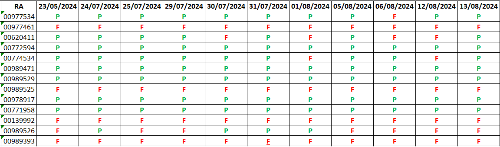
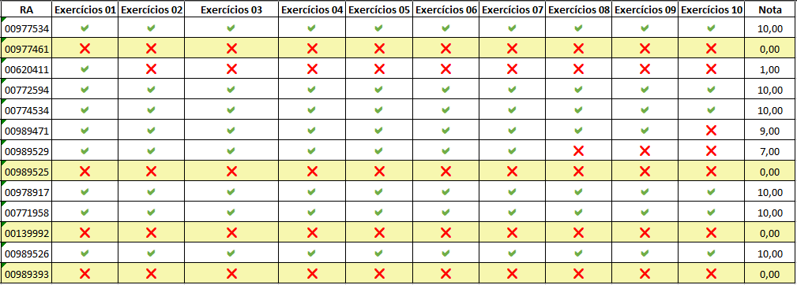
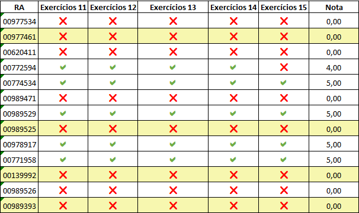
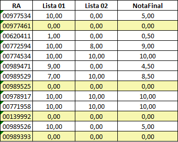

## Estrutura do Repositório

- aulas/: Contém os materiais das aulas, como slides, notas e códigos de exemplo.
- exercicios/: Contém os exercícios propostos durante o curso.
- projetos/: Contém os projetos desenvolvidos ao longo do curso.
- Imagens/: Contém as imagens usadas.

# Calendário

# Lista de Presença



# Notas Atividades


# Notas Atividades 02



# Média Final
MF = (ATV1*0.5)+(ATV2*0.5)



## Materiais de Aula

Os materiais das aulas estão organizados por módulo e aula:

```
aulas/
├── modulo1/
│ ├── aula1/
│ ├── aula2/
│ └── ...
├── modulo2/
│ ├── aula1/
│ ├── aula2/
│ └── ...
└── ...
```

# Exercícios

Os exercícios estão organizados por módulo e aula:

```
exercicios/
├── modulo1/
│ ├── aula1/
│ ├── aula2/
│ └── ...
├── modulo2/
│ ├── aula1/
│ ├── aula2/
│ └── ...
└── ...
```

# Projetos

Os projetos desenvolvidos ao longo do curso estão organizados por módulo:

```
projetos/
├── modulo1/
│ ├── projeto1/
│ └── ...
├── modulo2/
│ ├── projeto1/
│ └── ...
└── ...
```

# Contato

Para dúvidas ou mais informações, entre em contato:

    Instrutor: [Kevin Guimarães]
    Email: [kevinguimaraes.trabalho@gmail.com]

Aproveite o curso e bons estudos!