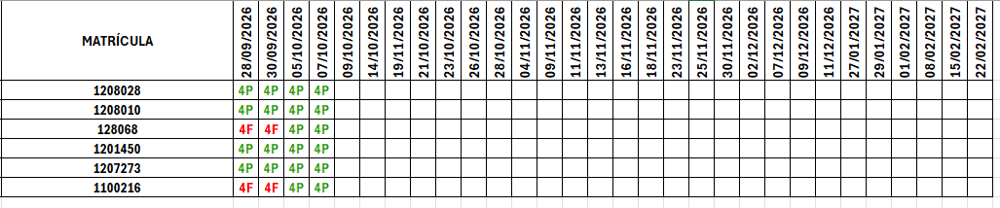

# Curso Técnico em Desenvolvimento de Sistemas
## Unidade Curricular: Programação de Aplicativos

Bem-vindo ao repositório da disciplina **Programação de Aplicativos** do curso Técnico em Desenvolvimento de Sistemas do SENAI Dois Vizinhos - PR. Aqui você encontrará todos os materiais, exercícios, desafios e atividades desenvolvidos durante as aulas.

## Índice

- [Visão Geral](#visão-geral)
- [Estrutura do Repositório](#estrutura-do-repositório)
- [Tecnologias Utilizadas](#tecnologias-utilizadas)
- [Contato](#contato)

## Objetivo da UC

Esta disciplina tem como objetivo proporcionar aos alunos o desenvolvimento das capacidades técnicas necessárias para criar interfaces web modernas, responsivas e interativas, utilizando tecnologias amplamente adotadas pelo mercado de desenvolvimento front-end.

### Carga Horária

- **Total:** 120 horas

### Objetivo Geral

Capacitar os alunos a desenvolver aplicações web utilizando HTML, CSS e JavaScript, aplicando boas práticas de desenvolvimento, versionamento de código e organização de projetos.

### Informações

# Calendário

# Lista de Presença



# Notas Atividades

# Média Final

### Conteúdos Formativos

#### 1. Fundamentos da Web

- Funcionamento da Internet e das aplicações web.
- Estrutura básica de páginas web.
- Organização de projetos.
- Hospedagem e publicação de aplicações.

#### 2. Controle de Versão

- Introdução ao Git.
- Criação e gerenciamento de repositórios.
- Commits, branches e merge.
- Utilização do GitHub para armazenamento e colaboração.
- Versionamento e rastreabilidade de código.

#### 3. Desenvolvimento com HTML5

- Estrutura semântica de páginas.
- Elementos de texto, listas e tabelas.
- Formulários e validações.
- Recursos multimídia.
- Boas práticas de acessibilidade.

#### 4. Desenvolvimento com CSS3

- Seletores e propriedades.
- Box Model.
- Posicionamento de elementos.
- Flexbox.
- Grid Layout.
- Responsividade.
- Transições e animações.

#### 5. Programação com JavaScript

- Variáveis e tipos de dados.
- Operadores.
- Estruturas condicionais.
- Estruturas de repetição.
- Funções.
- Arrays e objetos.
- Manipulação do DOM.
- Eventos.
- Armazenamento local.
- Consumo básico de APIs.

#### 6. Desenvolvimento de Interfaces

- Criação de layouts responsivos.
- Princípios de UX e UI.
- Organização e reutilização de código.
- Desenvolvimento de projetos integradores.

## Calendário da Disciplina

Confira o calendário de aulas, atividades e avaliações da disciplina no arquivo anexo.

## Critérios de Frequência e Aproveitamento

No curso, o(a) aluno(a) deve atender aos seguintes requisitos para ser considerado(a) **aprovado(a)**:

- **Frequência mínima:** 75% de presença em cada unidade curricular.
- **Nota mínima:** média final igual ou superior a **7,0 (sete)**.

### Como são contabilizadas as faltas

- Cada dia letivo corresponde a 4 aulas (4 horas-aula).
- As faltas são computadas por aula.
- Em **Programação de Aplicativos (120h = 30 dias = 120 aulas)** o limite de 25% equivale a **30 faltas permitidas (7 dias e meio)**.

### Sistema de Notas

- As notas são expressas de **0,0 a 10,0**.
- A média mínima exigida para aprovação é **7,0 (sete)**.
- Caso o(a) aluno(a) não alcance 7,0, poderá realizar **Recuperação Final**.

**Importante:**

- Mesmo que a nota seja suficiente, frequência abaixo de 75% reprova automaticamente.

## Capacidades Desenvolvidas

### Técnicas

- Desenvolver páginas web utilizando HTML5.
- Criar layouts responsivos com CSS3.
- Implementar interatividade utilizando JavaScript.
- Utilizar Git e GitHub para versionamento de projetos.
- Aplicar boas práticas de usabilidade e acessibilidade.
- Organizar e documentar projetos de desenvolvimento web.

### Socioemocionais

- Colaboração em atividades coletivas e projetos.
- Organização e planejamento das atividades.
- Comunicação eficaz em equipes de desenvolvimento.
- Resolução de problemas de forma estruturada.
- Responsabilidade e autonomia na execução de projetos.

## Ambientes Pedagógicos

- Laboratório de informática equipado com navegadores modernos.
- Visual Studio Code.
- Git.
- GitHub.
- Ferramentas de inspeção dos navegadores.

## Estrutura do Repositório

```text
/ProgramacaoDeAplicativos
│
├── Aulas
│   └── materiais
│
├── Exemplos
│   ├── html
│   ├── css
│   └── javascript
│
├── Exercicios
│   ├── html
│   ├── css
│   ├── javascript
│   └── desafios
│
├── Projetos
│   ├── landing-pages
│   ├── responsivos
│   └── integradores
│
└── Avaliacoes
    ├── atividades
    └── recuperacao
```

## Tecnologias Utilizadas

- HTML5
- CSS3
- JavaScript
- Git
- GitHub
- Visual Studio Code

## Metodologia

- Aulas práticas com desenvolvimento de projetos.
- Exercícios progressivos de fixação.
- Desenvolvimento de aplicações web.
- Utilização contínua de Git e GitHub.
- Aprendizagem baseada em resolução de problemas.
- Construção de portfólio de projetos front-end.

---

## Contato

- **Instrutor:** Kevin de Souza Guimarães
- **Email:** kevin.guimaraes3561@sesisenaipr.org.br